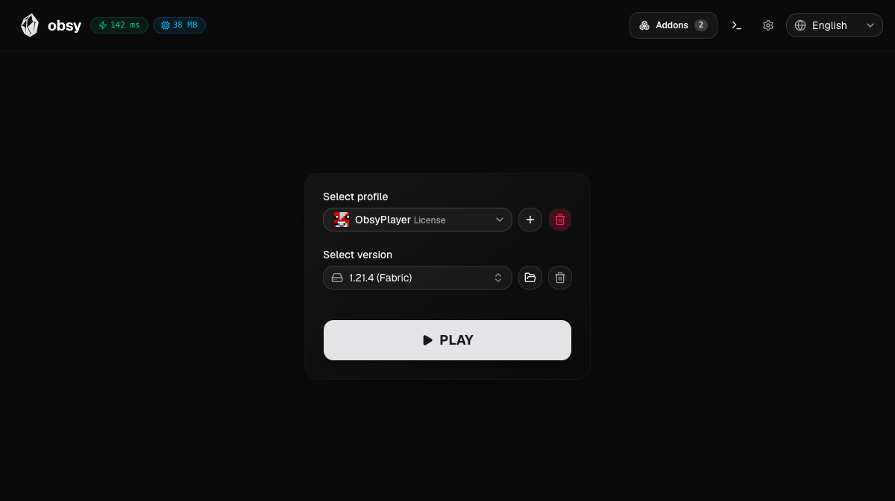
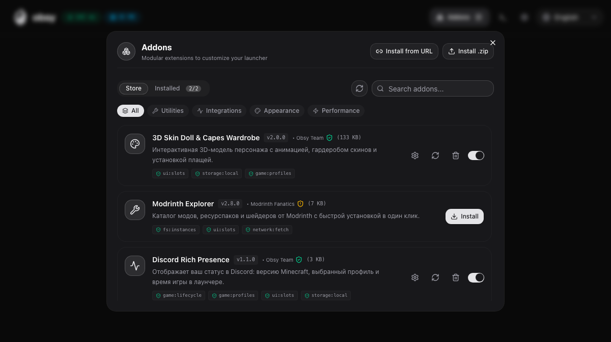
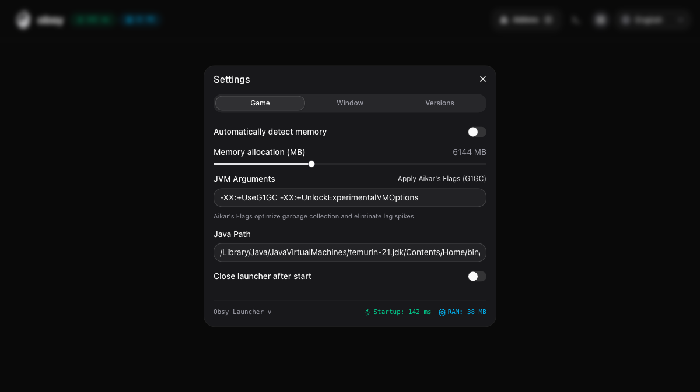
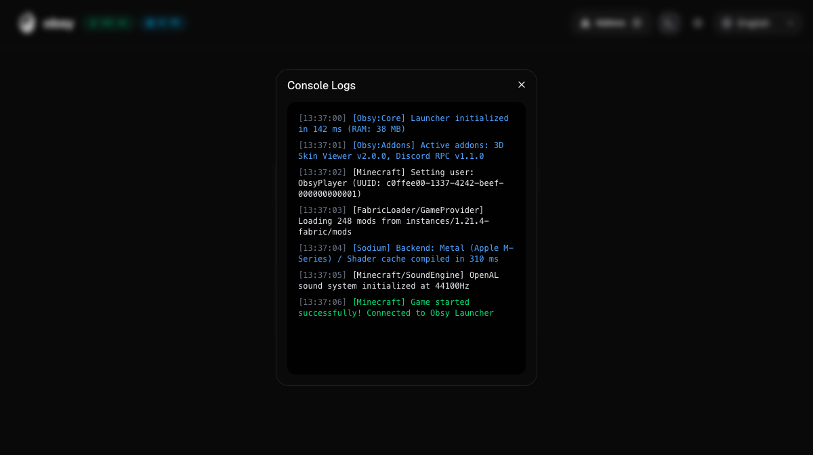

<div align="center">

# 💎 Obsy Launcher

**A blazing-fast, lightweight, and modern cross-platform Minecraft launcher.**

[](https://github.com/obsy-official/obsy-launcher/releases)
[](https://www.rust-lang.org/)
[](https://tauri.app/)
[](https://react.dev/)
[](LICENSE)

[🇷🇺 **Читать на русском**](#-obsy-launcher-русский) • [📥 **Download**](#-getting-started) • [🧩 **Addons Guide**](addons/README.md) • [🤝 **Contributing**](CONTRIBUTING.md)

<br/>



</div>

---

## ✨ Features

- ⚡ **Ultra-Fast & Resource-Efficient**: Starts in under **400 ms** with minimal RAM usage (~**40 MB** idle) thanks to the native Rust + Tauri v2 core.
- 🎨 **Sleek Modern Interface**: Responsive glassmorphic UI built with React 19, Tailwind CSS, Base UI, and smooth Framer Motion micro-animations.
- 🧩 **Modular Addon Ecosystem**: Extend launcher features on the fly with live widgets, Discord Rich Presence, Modrinth integration, 3D skin dolls, custom themes, and launch hooks.
- 🎮 **Universal Account Management**: Instant switching between Microsoft MSA and Offline accounts, with custom skin previews and cape wardrobe support.
- 🚀 **Smart Instance & Version Control**: Filter and launch Vanilla releases, snapshots, Fabric, Forge, NeoForge, and Quilt with isolated directories.
- 🛠️ **Power-User Performance Tweaks**: One-click Aikar's garbage collection flags, automatic RAM allocation detection, customizable JVM arguments, and live streaming console logs.
- 🌐 **Multi-Language Support**: English and Russian localization with seamless real-time switching.

---

## 📸 Visual Tour

<div align="center">

### 🧩 Addons Hub & Marketplace

Explore and install community addons, integrations, and widgets with granular permission safety checks.



<br/>

### ⚙️ Comprehensive Game & JVM Settings

Configure memory limits, Java runtime paths, optimized GC flags, and window resolutions.



<br/>

### 📟 Real-Time Live Game Console

Color-coded logs and diagnostic output streamed straight from the Minecraft engine and Rust backend.



</div>

---

## 🚀 Getting Started

### 📥 Download (For Players)

1. Head over to the [Releases](https://github.com/obsy-official/obsy-launcher/releases) page.
2. Grab the installer for your platform:
   - **Windows:** `.exe` (Installer) or `.msi`
   - **macOS:** `.dmg` (Apple Silicon & Intel)
   - **Linux:** `.AppImage` or `.deb`
3. Launch Obsy, select your profile, and enjoy Minecraft!

---

### 💻 Development (For Contributors)

#### Prerequisites

- [Node.js](https://nodejs.org/) (v18+) or [Bun](https://bun.sh/)
- [Rust & Cargo](https://www.rust-lang.org/tools/install) (stable)
- [Tauri v2 Prerequisites](https://tauri.app/v1/guides/getting-started/prerequisites)

#### Setup & Launch

```bash
# 1. Clone the repository
git clone https://github.com/obsy-official/obsy-launcher.git
cd obsy-launcher

# 2. Install dependencies
npm install

# 3. Build built-in addons
npm run build:addons

# 4. Start the launcher in development mode
npm run tauri dev
```

#### Build Production Bundles

```bash
npm run tauri build
```

---

## 🧩 Addon Development

Obsy Launcher features a plugin architecture allowing developers to build rich addons using TypeScript and React:

- **Addon slots**: Mount widgets to dashboard cards, header actions, and sidebars.
- **Launch hooks**: Intercept game launches, inject custom JVM arguments, and run pre-flight scripts.
- **Sandboxed permissions**: Safe access to profile storage, instance directories, and network.

👉 Read the [Addon Development Guide](addons/README.md) to build your first addon in minutes.

---

## 🛠️ Tech Stack

| Layer                | Technologies                                      |
| -------------------- | ------------------------------------------------- |
| **Frontend Core**    | React 19, TypeScript, Vite, Base UI               |
| **Styling & Motion** | Tailwind CSS v4, Framer Motion, Lucide Icons      |
| **3D Graphics**      | skinview3d (Three.js WebGL skin & cape rendering) |
| **Desktop Runtime**  | Tauri v2, WebKit / WebView2                       |
| **Native Backend**   | Rust 2021, Tokio, Reqwest, Serde                  |

---

<br/>
<br/>

---

<div align="center">

# 🇷🇺 Obsy Launcher (Русский)

**Молниеносный, легковесный и современный кроссплатформенный лаунчер для Minecraft.**

[📥 **Скачать**](#-скачивание-для-игроков) • [🧩 **Руководство по аддонам**](addons/README.md) • [🤝 **Участие в разработке**](CONTRIBUTING.md) • [📄 **Лицензия**](LICENSE)

<br/>


</div>

---

## ✨ Возможности

- ⚡ **Максимальная производительность**: Время холодного запуска менее **400 мс**, потребление оперативной памяти в фоне ~**40 МБ** благодаря связке Rust и Tauri v2.
- 🎨 **Современный стеклянный интерфейс**: UI на React 19 и Tailwind CSS с плавной анимацией на Framer Motion.
- 🧩 **Модульный движок аддонов**: Расширяйте возможности лаунчера прямо на лету — 3D-модель персонажа с гардеробом плащей, Discord Rich Presence, каталог Modrinth, темы и хуки запуска.
- 🎮 **Удобное управление аккаунтами**: Мгновенное переключение между аккаунтами Microsoft (MSA) и оффлайн-профилями, синхронизация скинов и плащей.
- 🚀 **Поддержка любых версий и модпаков**: Запуск официальных релизов, снапшотов, Fabric, Forge, NeoForge и Quilt в изолированных директориях.
- 🛠️ **Тонкая оптимизация**: Применение флагов сборщика мусора Aikar's Flags в один клик, автоопределение памяти, кастомные аргументы JVM и встроенная консоль с логами.
- 🌐 **Двуязычный интерфейс**: Полная поддержка русского и английского языков с переключением в реальном времени.

---

## 📸 Скриншоты

<div align="center">

### 🧩 Центр аддонов (Obsy Addons Hub)

Каталог модулей, тем и интеграций с проверкой безопасности и детальным списком разрешений.


<br/>

### ⚙️ Настройки производительности и графики

Управление выделением памяти (RAM), выбор версии Java, аргументы JVM и параметры экрана.


<br/>

### 📟 Консоль и диагностические логи

Вывод логов клиента игры и бэкенда лаунчера в режиме реального времени с подсветкой синтаксиса.


</div>

---

## 🚀 Как начать

### 📥 Скачивание (Для игроков)

1. Перейдите в раздел [Releases](https://github.com/obsy-official/obsy-launcher/releases).
2. Загрузите установщик для вашей системы:
   - **Windows:** `.exe` (Установщик) или `.msi`
   - **macOS:** `.dmg` (Apple Silicon M1/M2/M3/M4 и Intel)
   - **Linux:** `.AppImage` или `.deb`
3. Установите лаунчер, выберите версию Minecraft и запускайте игру!

---

### 💻 Разработка (Для разработчиков)

#### Требования

- [Node.js](https://nodejs.org/) (версия 18+) или [Bun](https://bun.sh/)
- [Rust и Cargo](https://www.rust-lang.org/tools/install)
- [Зависимости Tauri v2](https://tauri.app/v1/guides/getting-started/prerequisites)

#### Сборка и запуск

```bash
# 1. Клонирование репозитория
git clone https://github.com/obsy-official/obsy-launcher.git
cd obsy-launcher

# 2. Установка зависимостей
npm install

# 3. Сборка встроенных аддонов
npm run build:addons

# 4. Запуск в режиме разработки
npm run tauri dev
```

#### Сборка релизного бинарника

```bash
npm run tauri build
```

---

## 🤝 Вклад в проект

Мы рады любой помощи в развитии проекта! Перед отправкой Pull Request, пожалуйста, ознакомьтесь с файлом [CONTRIBUTING.md](CONTRIBUTING.md).

---

## 📄 Лицензия

Проект распространяется под открытой лицензией [MIT](LICENSE).
